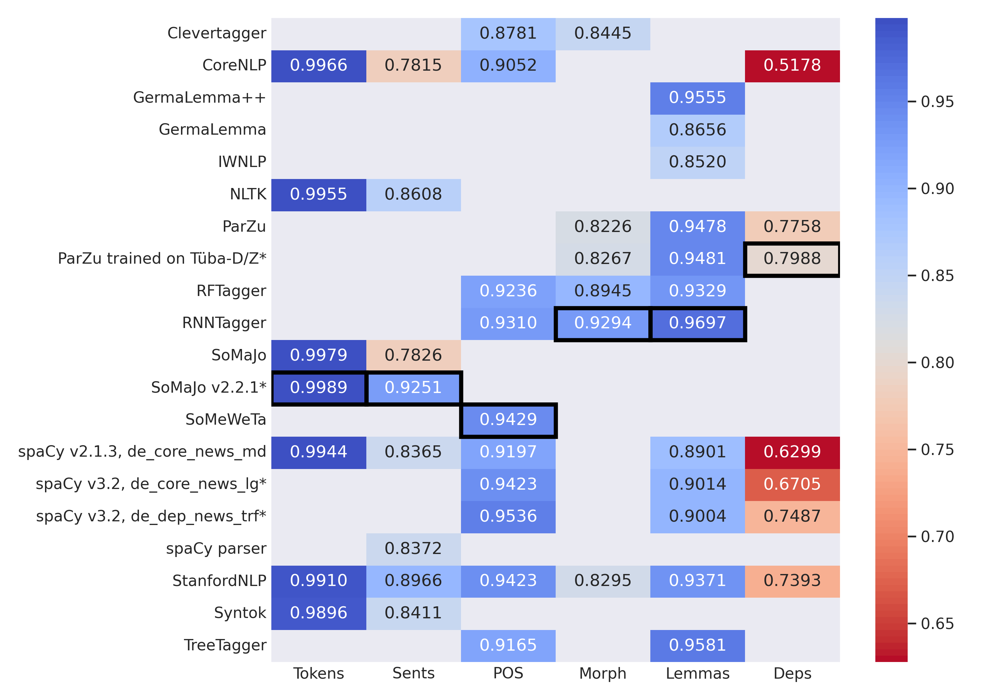

# Model Selection

The selection of the language models / NLP tools for the LLP pipeline was primarily guided by the “Evaluation of off-the-shelf NLP tools for German” by [Ortmann, Roussel, Dipper (2019)](#ref-ortmann_evaluating_2019). We refer to the publication for details on the evaluated systems. Additionally, we perform evaluations on the same dataset for 

- latest Spacy v3.2,
- ParZu, with “improved statistic” derived from the non-free [Tüba-D/Z](https://uni-tuebingen.de/en/faculties/faculty-of-humanities/departments/modern-languages/department-of-linguistics/chairs/general-and-computational-linguistics/ressources/corpora/tueba-dz/) corpus.

Overall F1 scores (for tokens and sentences) or accuracy (otherwise) for all systems at annotation level. Data reproduced from [Ortmann, Roussel, Dipper (2019)](#ref-ortmann_evaluating_2019). Systems with * were not part of said evaluation and are supplied by own evaluation runs on the same dataset. The cells of the final model selection are boxed.

On the basis of these evaluations, the models selected for the default LLP pipeline are

* Tokenization and Sentence Splitting via **NLTK** [(Bird, Klein, Loper 2009)](#ref-bird_natural_2009):

  NLTK implements tokenization and sentence splitting via the PUNKT algorithm [(Kiss, Strunk 2006)](#ref-kiss_unsupervised_2006). [Webpage](https://www.nltk.org/_modules/nltk/tokenize/punkt.html). This system gives the best performance when considering both tokenization and sentence splitting (and hence appears to perform better than, e.g., SoMaJo)

* POS tagging via **SoMeWeTa** [(Proisl 2018)](#ref-proisl_someweta_2018):

  Based on averaged structured perceptron; focuses on web and social media texts. [Github](https://github.com/tsproisl/SoMeWeTa). Latest Spacy (v3.2, de_dep_news_trf) appears to perform marginally better, but SoMeWeTa tags significantly faster, and does not require a GPU.

 
* Lemmatization and Morphological Analysis via **RNNTagger** [(Schmid 2019)](#ref-schmid_deep_2019):

  Based on LSTMs with character-based word representations and lemmatizes using an encoder-decoder system with attention. [Webpage](https://www.cis.uni-muenchen.de/~schmid/tools/RNNTagger/). Overall best performance in both lemmatization and morphological analysis.

* Dependency Parsing via **ParZu**, trained on TüBa-D/Z, with Zmorge as included morpholgical analyzer ([Sennrich, Schneider, Volk, Warin 2009](#ref-sennrich_new_2009); [Sennrich, Volk, Schneider 2013](#ref-sennrich_exploiting_2013); [Sennrich, Kunz 2014](#ref-sennrich_zmorge_2014)):

  Hybrid architecture using hand-written rules and statistical disambiguation to support a core CYK parser.
  [Github](https://github.com/rsennrich/ParZu). Only marginally better than Spacy (v3.2, de_dep_news_trf), but significantly slower due to the parser being implemented in Prolog. The default pipeline increases the speed by parallelizing on multiple cores.

Additionally, the following models have been integrated for further text processing, without a detailed comparative evaluation. In all cases, the respective publications report scores higher than the state-of-the-art models at that time.

* Named Entity Recognition via **FLERT** [(Schweter, Akbik 2021)](#ref-schweter_flert_2021):
  uses document-level features derived from XLM-R embeddings.
  [Github](https://github.com/flairNLP/flair). 

* Coreference Resolution via BERT Embeddings [(Schröder, Hatzel, Biemann 2021)](#ref-schroder_neural_2021).
  [Github](https://github.com/uhh-lt/neural-coref/tree/konvens).

* Tagging of German speech, thought and writing representation (STWR) using the **Redewiedergabe Tagger**. Based on Flair/BERT embeddings [(Brunner, Tu, Weimer, Jannidis 2020)](#ref-brunner_bert_2021).
  [Github](https://github.com/redewiedergabe/tagger).

* Semantic Role Labeling via **InVeRo-XL**. Based on XLM-R embeddings. [(Conia, Orlando, Cecconi, Navigli 2021)](#ref-conia_invero-xl-2021)

## References

Bird, Steven, Ewan Klein, and Edward Loper. 2009. <em>Natural Language Processing with Python</em>. Cambridge, Mass.: O’Reilly.

Brunner, Annelen, Ngoc Duyen Tanja Tu, Lukas Weimer, and Fotis Jannidis. 2021. “To BERT or Not to BERT – Comparing Contextual Embeddings in a Deep Learning Architecture for the Automatic Recognition of Four Types of Speech, Thought and Writing Representation.” In <em>Proceedings of the 5th Swiss Text Analytics Conference (SwissText) &amp; 16th Conference on Natural Language Processing (KONVENS)</em>, 2624:11. CEUR Workshop Proceedings. Zurich, Switzerland. <a href="http://ceur-ws.org/Vol-2624/paper5.pdf">http://ceur-ws.org/Vol-2624/paper5.pdf</a>.

Conia, Simone, Riccardo Orlando, Fabrizio Brignone, Francesco Cecconi, and Roberto Navigli. 2021. “InVeRo-XL: Making Cross-Lingual Semantic Role Labeling Accessible with Intelligible Verbs and Roles.” In <em>Proceedings of the 2021 Conference on Empirical Methods in Natural Language Processing: System Demonstrations</em>, 319–28. Online; Punta Cana, Dominican Republic: Association for Computational Linguistics. <a href="https://doi.org/10.18653/v1/2021.emnlp-demo.36">https://doi.org/10.18653/v1/2021.emnlp-demo.36</a>.

Ortmann, Katrin, A. Roussel, and Stefanie Dipper. 2019. “Evaluating Off-the-Shelf NLP Tools for German.” In <em>Proceedings of the 15th Conference on Natural Language Processing (KONVENS 2019)</em>, 212–22. Erlangen, Germany: German Society for Computational Linguistics &amp; Language Technology. <a href="https://konvens.org/proceedings/2019/papers/KONVENS2019_paper_55.pdf">https://konvens.org/proceedings/2019/papers/KONVENS2019_paper_55.pdf</a>.

Proisl, Thomas. 2018. “SoMeWeTa: A Part-of-Speech Tagger for German Social Media and Web Texts.” In <em>Proceedings of the Eleventh International Conference on Language Resources and Evaluation (LREC 2018)</em>, 665–70. Miyazaki, Japan: European Language Resources Association ELRA. <a href="http://www.lrec-conf.org/proceedings/lrec2018/pdf/49.pdf">http://www.lrec-conf.org/proceedings/lrec2018/pdf/49.pdf</a>.

Schmid, Helmut. 2019. “Deep Learning-Based Morphological Taggers and Lemmatizers for Annotating Historical Texts.” In <em>DATeCH, Proceedings of the 3rd International Conference on Digital Access to Textual Cultural Heritage</em>, 133–37. Brussels, Belgium: Association for Computing Machinery. <a href="https://www.cis.uni-muenchen.de/~schmid/papers/Datech2019.pdf">https://www.cis.uni-muenchen.de/~schmid/papers/Datech2019.pdf</a>.

Schröder, Fynn, Hans Ole Hatzel, and Chris Biemann. 2021. “Neural End-to-End Coreference Resolution for German in Different Domains.” In <em>Proceedings of the 17th Conference on Natural Language Processing (KONVENS 2021)</em>, 170–81. Düsseldorf, Germany: KONVENS 2021 Organizers. <a href="https://aclanthology.org/2021.konvens-1.15">https://aclanthology.org/2021.konvens-1.15</a>.

Schweter, Stefan, and Alan Akbik. 2021. “FLERT: Document-Level Features for Named Entity Recognition.” <em>arXiv:2011.06993 [Cs]</em>, May. <a href="http://arxiv.org/abs/2011.06993">http://arxiv.org/abs/2011.06993</a>.

Sennrich, Rico, and Beat Kunz. 2014. “Zmorge: A German Morphological Lexicon Extracted from Wiktionary.” In <em>Proceedings of the Ninth International Conference on Language Resources and Evaluation (LREC’14)</em>, 1063–67. Reykjavik, Iceland: European Language Resources Association (ELRA). <a href="http://www.lrec-conf.org/proceedings/lrec2014/pdf/116_Paper.pdf">http://www.lrec-conf.org/proceedings/lrec2014/pdf/116_Paper.pdf</a>.

Sennrich, Rico, G. Schneider, M. Volk, M. Warin, C. Chiarcos, Richard Eckart de Castilho, and Manfred Stede. 2009. “A New Hybrid Dependency Parser for German.” In <em>Proceedings of the GSCL Conference</em>. Potsdam, Germany. <a href="https://doi.org/10.5167/UZH-25506">https://doi.org/10.5167/UZH-25506</a>.

Sennrich, Rico, Martin Volk, and Gerold Schneider. 2013. “Exploiting Synergies Between Open Resources for German Dependency Parsing, POS-Tagging, and Morphological Analysis.” In <em>Proceedings of the International Conference Recent Advances in Natural Language Processing RANLP 2013</em>, 601–9. Hissar, Bulgaria: INCOMA Ltd. Shoumen, BULGARIA. <a href="https://www.aclweb.org/anthology/R13-1079">https://www.aclweb.org/anthology/R13-1079</a>.

